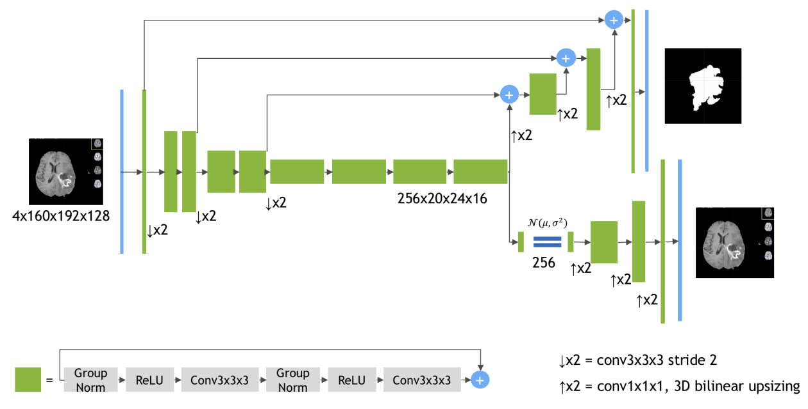
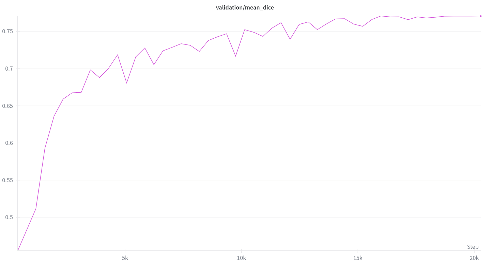
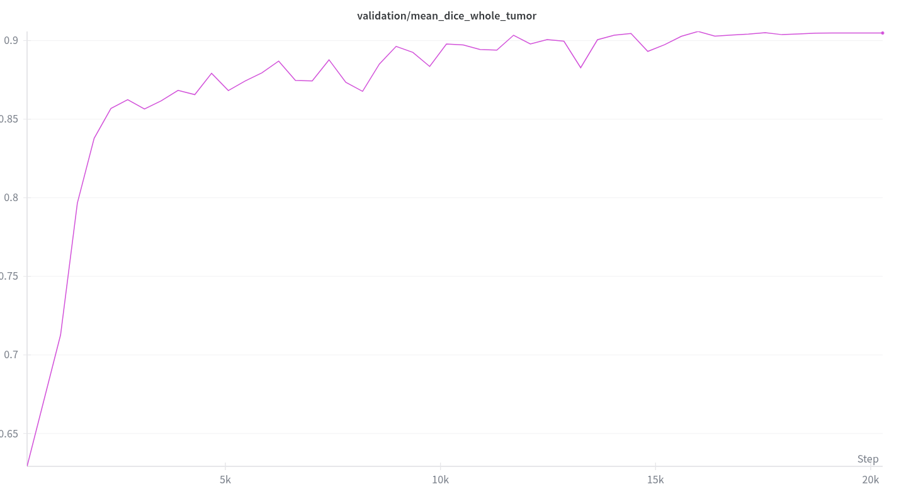
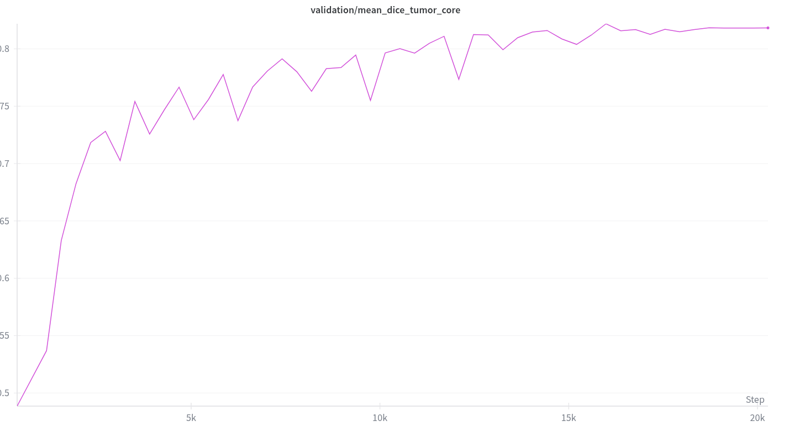
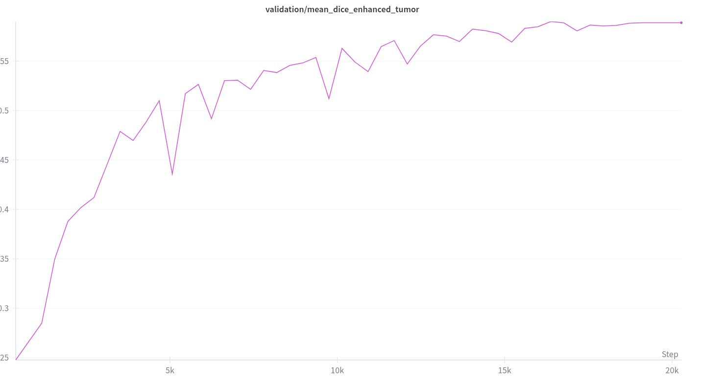
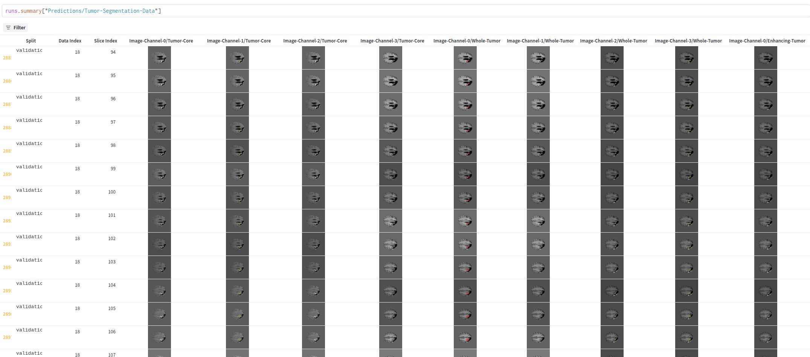
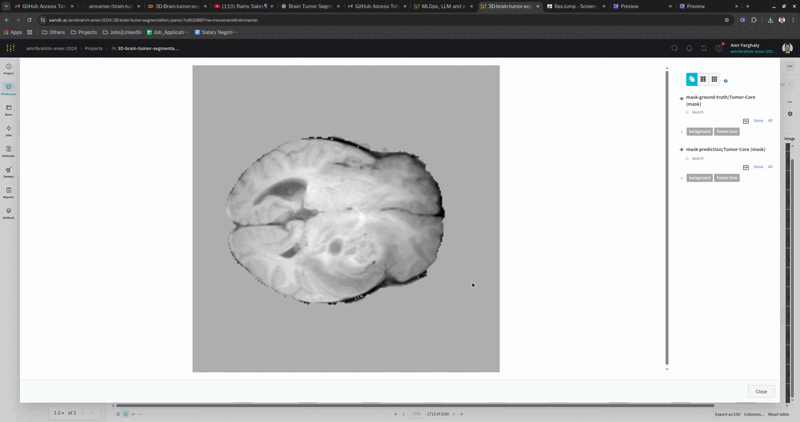

<table>
<tr>
<td width="100%" align="center">
  <br>
  <sub><b>W&B Visualization:</b> Multimodal MRI slices with corresponding tumor regions segmentation mask for dataset validation.</sub>
</td>
</tr>
<tr>
<td width="100%" align="center">
  <br>
  <sub><b>Brats Tumor regions:</b> BraTS-compliant annotation of tumor regions in different modalities.</sub>
</td>
</tr>
</table>


# 3D Brain Tumor Segmentation from Multimodal MRI

This repository presents an end-to-end workflow for **multi-label brain tumor segmentation** from 3D multimodal MRI scans. The project targets segmentation of **glioma subregions** (tumor core, whole tumor, enhancing tumor) using a **3D SegResNet** model, trained with **Dice loss** and evaluated using **Mean Dice metrics**. The pipeline is implemented with **PyTorch** and **MONAI**, and experiment tracking, visualization, and artifact management are integrated through **Weights & Biases (W&B)**.

---

## Key Features

- 3D multi-label segmentation of gliomas
- Multimodal MRI input (FLAIR, T1, T1Gd, T2)
- **3D SegResNet** architecture with mixed-precision training
- Dice Loss optimization + Mean Dice evaluation
- Sliding window inference for volumetric prediction
- End-to-end W&B experiment tracking
- ROI-based patch sampling for computational efficiency
- Checkpointing, logging, and interactive visualization

---

## Dataset

**Source:** Medical Segmentation Decathlon – Task 01 Brain Tumor  
**Link:** http://medicaldecathlon.com/  
**Data format:** 750 multimodal 3D MRI volumes (484 train / 266 test)  
**Modalities:** FLAIR, T1w, T1gd, T2w

**Multi-Label Channel Mapping**

| Channel | Clinical Target Class            | Description                                 |
|---------|----------------------------------|---------------------------------------------|
| 0       | Tumor Core (TC)                  | Non-enhancing + necrotic core              |
| 1       | Whole Tumor (WT)                 | Edema + Core + Enhancing                   |
| 2       | Enhancing Tumor (ET)             | Actively enhancing tumor tissue            |

This follows the BraTS standard labeling convention (IEEE TMI).

---

## Methodology Overview

**Pipeline Steps**
1. Data download & preprocessing
2. One-hot label conversion to multi-channel segmentation
3. Spatial normalization (RAS orientation, voxel spacing)
4. ROI-based 3D patch extraction
5. SegResNet training with mixed precision
6. Sliding window inference for volume-level prediction
7. Visualization & evaluation in W&B

**Core Transforms**
- `Orientationd`, `Spacingd`
- `NormalizeIntensityd`
- `RandSpatialCropd`
- `RandFlipd`, `RandShiftIntensityd`, `RandScaleIntensityd`

---

## Model Architecture

This project uses a **3D SegResNet** backbone for volumetric glioma segmentation, following the architecture introduced in  
**"3D MRI Brain Tumor Segmentation Using Autoencoder Regularization"** [original SegResNet paper, included in this repo for reference](docs/paper.pdf).

SegResNet is a **residual encoder–decoder** optimized for 3D medical imaging, enabling multi-scale feature extraction across MRI modalities and stable training on heterogeneous clinical data.

<p align="center">
  
</p>


**PyTorch/MONAI implementation:**
```python
from monai.networks.nets import SegResNet
model = SegResNet(
    in_channels=4,   # FLAIR, T1, T1Gd, T2
    out_channels=3,  # TC, WT, ET (BraTS multi-label targets)
    init_filters=16,
    blocks_down=[1, 2, 2, 4],
    blocks_up=[1, 1, 1],
    dropout_prob=0.2,
).to(device)
```

---

## Training Configuration

| Parameter | Value |
|-----------|--------|
| Loss | Dice Loss |
| Optimizer | Adam |
| LR Scheduler | Cosine Annealing |
| Initial LR | 1e-4 |
| Epochs | 50 |
| Batch Size | 1 |
| ROI Crop | `[224, 224, 144]` |
| AMP | Enabled (Mixed Precision) |

**Dice Loss**

$$
L_{dice} = \frac{2 \sum p_{true} \cdot p_{pred}}{\sum p_{true}^2 + \sum p_{pred}^2 + \epsilon}
$$


---

## Results & Evaluation

**Primary Metric:** Mean Dice (validation)

| Class             | Dice Score (Val) |
|-------------------|------------------|
| Tumor Core (TC)   | 0.82             |
| Whole Tumor (WT)  | 0.9              |
| Enhancing Tumor   | 0.59             |
| **Mean Dice**     | 0.78             |


<table>
  <tr>
    <td align="center" width="50%">
      <br>
      <sub><b>Mean Dice Score:</b> Overall segmentation performance across all tumor regions (WT + TC + ET).</sub>
    </td>
    <td align="center" width="50%">
      <br>
      <sub><b>Whole Tumor (WT):</b> Dice progression for full tumor + edema across epochs.</sub>
    </td>
  </tr>
  <tr>
    <td align="center" width="50%">
      <br>
      <sub><b>Tumor Core (TC):</b> Dice progression for necrotic/solid tumor core segmentation.</sub>
    </td>
    <td align="center" width="50%">
      <br>
      <sub><b>Enhancing Tumor (ET):</b> Dice progression for contrast-enhancing active tumor tissue.</sub>
    </td>
  </tr>
</table>


---

## Interpreting Model Predictions

Each MRI scan is processed slice-by-slice across **four modalities** (FLAIR, T1, T1Gd, T2).  
For every slice, the model predicts **three clinically relevant tumor subregions**:

- **WT – Whole Tumor:** full lesion extent including surrounding edema
- **TC – Tumor Core:** central necrotic/solid region within the mass
- **ET – Enhancing Tumor:** biologically active contrast-enhancing tissue

Weights & Biases logs these predictions in a table using the format:

```
Image-Channel-X / Region  
e.g., Image-Channel-0/Whole-Tumor → WT overlay on FLAIR
```

This does **not** indicate 12 classes.  
It is **3 regions visualized across 4 modalities** to check if predictions line up with radiological expectations.

---

### Region–Modality Pairing (Expected Visibility)

| Tumor Region | Best Viewed On | Why This Modality? |
|--------------|----------------|---------------------|
| **WT – Whole Tumor** | **FLAIR** | Edema and lesion spread appear brightest; clearest boundary of disease extent |
| **TC – Tumor Core** | **T2** | Necrosis and internal structure are well defined by fluid contrast |
| **ET – Enhancing Tumor** | **T1Gd** (contrast) | Active regions uptake contrast, indicating BBB disruption and tumor activity |
| *(reference modality)* | **T1** | Baseline anatomy; complements other sequences |

```
WT → FLAIR   (extent)
TC → T2      (core structure)
ET → T1Gd    (active tumor)
T1 → anatomical context
```

---

## Prediction Table (Slice-by-Slice Evaluation)

Predictions are logged for each slice to visually assess segmentation performance across modalities:





Each column corresponds to a region overlay on a specific modality, for example:

```
Image-Channel-0/Whole-Tumor  → WT on FLAIR
Image-Channel-2/Enhancing-Tumor → ET on T1Gd
Image-Channel-3/Tumor-Core → TC on T2
```

This format allows rapid verification of:
- Region visibility per modality  
- Slice-by-slice consistency  
- Potential false positives / missed boundaries  

---

## Visual Examples (Region-by-Modality)

The following examples are taken directly from model predictions and demonstrate how each region is most interpretable on its corresponding modality.

**Whole Tumor (WT) on FLAIR**


**Tumor Core (TC) on T2**





**Enhancing Tumor (ET) on T1Gd**


*These visualizations confirm that the model’s behavior aligns with conventional MRI interpretation in glioma imaging.*

---

## Compact Visual Mental Model

The tumor behaves like layered structures, each best revealed by a specific MRI sequence:

```
                Whole Tumor (WT)
           [ FLAIR – edema & total extent ]
        ┌────────────────────────────────────┐
        │           Tumor Core (TC)          │
        │    [ T2 – necrotic / solid mass ]  │
        │       ┌────────────────────────┐   │
        │       │   Enhancing Tumor      │   │
        │       │ [ T1Gd – active area ] │   │
        │       └────────────────────────┘   │
        └────────────────────────────────────┘
```


**In one sentence:**  
FLAIR shows the **big picture**, T2 clarifies the **core**, and T1Gd exposes the **active tumor**.
## Code Structure

```
📦 3D-brain-tumor-segmentation
├── 3D_Brain_tumor_segmentation.ipynb      # Main training notebook
├── checkpoints/                           # Model weights (ignored in version control)
├── assets/                                # Images, GIFs, videos for README
├── dataset/                               # Local MRI dataset (add to .gitignore)
├── docs/                                  # segresnet original paper and project report
├── requirements.txt
├── LICENSE
└── README.md
```

---

## Usage

### 1. Install Dependencies
```
pip install -r requirements.txt
```

### 2. Run Training (Notebook Execution)
```
Open and execute:
3D_Brain_tumor_segmentation.ipynb
```

### 3. Load Best Model for Inference
```python
model.load_state_dict(torch.load("checkpoints/model.pth"))
model.eval()
```

---

## Experiment Tracking (W&B)

This project logs:
- Training/validation metrics
- Model checkpoints as **versioned artifacts**
- Slice-by-slice overlay visualizations
- Full prediction comparison tables

W&B Project workspace link:
```
https://wandb.ai/amribrahim-amer-2024/3D-brain-tumor-segmentation
```

---

## Challenges & Considerations

- High variability of tumor morphology
- Class imbalance across subregions
- Dependence on modality visibility
- Computational cost of 3D models

---

## Future Work

- SwinUNETR / UNETR backbone (transformer-based)
- MONAI Deploy inference pipeline
- External validation against BraTS data
- Uncertainty estimation & calibration
- Model pruning for deployment

---

## References

- MONAI: https://monai.io/
- Medical Decathlon: http://medicaldecathlon.com/
- BraTS Challenge Publications (IEEE TMI / MICCAI)
- "3D MRI brain tumor segmentation using autoencoder regularization"

---

## License

This project is licensed under the **MIT License**.  
See the `LICENSE` file for details.

---

## Author

**Amr Amer**  
Medical Imaging & Deep Learning Research – 2024

---

